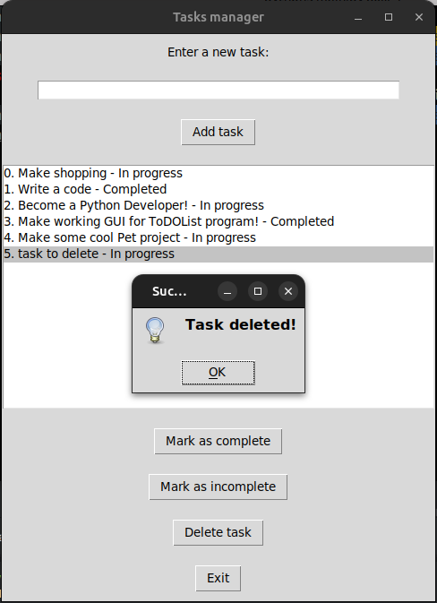

# ToDoList

This is a ToDo application written in Python that uses JSON as a storage. The application is available in two versions:

1. CLI version
2. GUI version

## Features

- Add tasks
- Delete tasks
- Mark tasks as complete/incomplete
- List all tasks

## Requirements

- Python 3.12

## Installation

1. Clone the repository:
    ```sh
    git clone https://github.com/RYZHAIEV-SERHII/ToDoList.git
    cd ToDoList
    ```

## Usage

### Console Version

Navigate to the `todolist_cli` folder and run the CLI version using the following command:

```sh
cd todolist_cli
python main.py
```

### GUI Version

Navigate to the `todolist_gui` folder and run the GUI version using the following command:

```sh
cd todolist_gui
python main.py
```

#### GUI Features

- Add a new task using the input field and "Add Task" button.

- Delete a task by selecting it and clicking the "Delete Task" button.

- Mark a task as complete/incomplete by selecting it and clicking the "Complete" or "Incomplete" button.

- View all tasks in the list.

## Screenshots

### Console Version

<div style="display:flex;overflow-x:auto;"> 
 
 


</div>

### GUI Version

<div style="display:flex;overflow-x:auto;"> 
 
 

</div>
